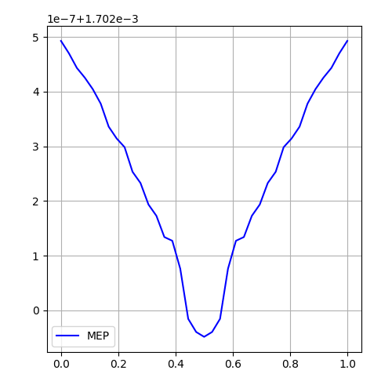
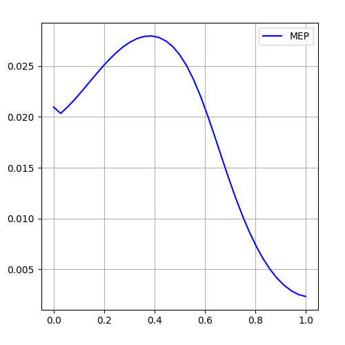
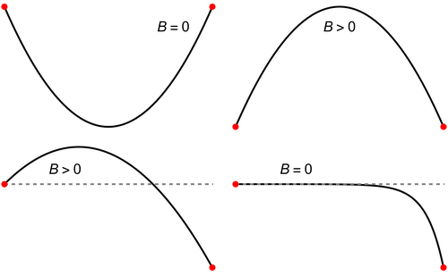

## 1. Loss Landscape Picture
### Methodology
#### Finding Minimum Energy Paths
In `mep.py` the function `get_path` finds minimum energy path between two minimizers $\theta_1$ and $\theta_2$ with NEB algorithm ([Draxler *et al.*, 2018](https://arxiv.org/pdf/1803.00885)), it starts with linear interpolation

$$p=\{(1-\alpha)\theta_1 + \alpha\theta_2: \alpha\in(0,1) \}$$

pivots in $p$ are connected with springs with $k$ spring constant. for each $p_i\in p$ tangent vector is defined:

$$\tau_i=\begin{cases}
  p_{i+1}-p_i & \text{if } L(p_{i+1}) > L(p_{i-1}) \\
  p_i-p_{i-1}  & \text{else }
\end{cases}$$

each $p_i$ is updated with forces, spring force parallel to $\tau_i$ and loss gradient force perpendicular to $\tau_i$, the spring force is:

$$F_i^S=-k(||p_i-p_{i-1}||-||p_{i+1}-p_i||)\tau_i$$

for perpendicular force from loss
$$F_i^L=-(\nabla_\theta L(p_i)-(\nabla_\theta L(p_i)\cdot\tau_i)\tau_i)$$
Then we update pivots with with learning rate $\eta$

$$p_i\leftarrow p_i + \eta(F_i^L+F_i^S)$$

to get minimum energy path in function space, use natural gradient $\nabla_\theta\to\nabla_E$

#### Natural Gradient Descent
In `eng.py` the function `train_pinn_engd` updates the parameters $\theta \in \mathbb{R}^P$ using natural gradient descent ([Müller & Zeinhofer, 2023](https://arxiv.org/pdf/2302.13163))

$$\theta\leftarrow\theta-\eta\nabla_EL(\theta)$$

Where natural gradient is defined as:

$$\nabla_EL(\theta)=G^+_E(\theta)\nabla_\theta L(\theta)$$

Where $G_E\in\mathbb{R}^{P\times P}$ is energy gram matrix which for 1D poisson $u_{xx}=f$ solving on $\Omega$ takes the form

$$G_E(\theta)_{ij}=\int_\Omega(\partial_x^2\partial_{\theta_i}u_\theta(x))(\partial_x^2\partial_{\theta_j}u_\theta(x))dx+\int_{\partial \Omega}\partial_{\theta_i}u_\theta(s)\partial_{\theta_j}u_\theta(s)ds$$

We calculate this integral for the Gram matrix using the collocation points on the interior $\{x_i\}_{i=1}^N$ and on the boundary $\{x_i\}_{i=1}^M$

$$G_E(\theta)_{ij}\approx\frac{1}{N}\sum_{k=1}^N(\partial_x^2\partial_{\theta_i}u_\theta(x_k))(\partial_x^2\partial_{\theta_j}u_\theta(x_k))+\frac{1}{M}\sum_{m=1}^M\partial_{\theta_i}u_\theta(x_m)\partial_{\theta_j}u_\theta(x_m)$$

To get the pseudo inverse of $G_E$ we solve the following least squares with `torch.linalg.lstsq`

$$\nabla_EL(\theta)=\argmin_{\psi\in\mathbb{R}^P}||G_E(\theta)\psi-\nabla_\theta L(\theta)||^2$$

Constant learning rate $\eta$ may overshoot, leading to oscillations or divergence. Do line search for optimal $\eta$ on interval $[0,1]$, i.e. choose $\eta\in[0,1]$ which gives lowest error after parameter update

$$\eta^* ← \argmin_{\eta\in[0,1]} L(\theta − η\nabla_E L(\theta))$$

### Initial Results
We look at solving 1D possion equation problem:

$$\begin{align*}
& \partial_{xx}u(x)=-\pi^2\sin(\pi x),\quad x\in(0,1) \\
& u(0) = 0, \quad u(1) = 0 
\end{align*}$$

Using gradient descent and E-NGD We find two solutions $\theta_1$ and $\theta_2$ to neural network minimizing it's PINN loss:

$$L(u_\theta)=\frac{1}{2}\int_{\Omega}(\mathcal{L}u_\theta-f)^2dx+\int_{\partial\Omega}(\mathcal{B}u_\theta-g)^2ds$$

This integral is evaluated on collocation points on $[0,1]$

$$L(u_\theta)=\sum_{i}\partial_{xx}u_{\theta}(x_i)+u(0)+u(1)$$

#### Path from GD to GD
Neural network with 2 hidden layers with 15 neurons and $\tanh$ activation. Solutions $\theta_1$ and $\theta_2$ both found with 50k steps of gradient descent. NEB algorithm with 300 steps and $\gamma=0.001$

#### Path from GD to E-NGD
Neural network with 2 hidden layers with 15 neurons and $\tanh$ activation. Solution $\theta_1$ found with 5k steps of gradient descent and $\theta_2$ with E-NGD with 80 steps. NEB algorithm with 300 steps and $\gamma=0.001$

### Next Steps

#### Target Solution Complexity
Experiments on 2D poisson equation and with high frequency solutions

$$\begin{align*}
& \Delta u(x,y)=\sin(\omega x)\sin(\omega y),\quad x\in\Omega \\
& u(x) = 0, \quad x\in\partial\Omega
\end{align*}$$

On square $\Omega=[0,1]\times[0,1]$

#### Reachability

Numerical experiments on barrier between two solutions $\theta_1$ and $\theta_2$, with barrier defined on minimum energy path $p_{\theta_1\leftrightarrow\theta_2}$ found with some optimization method as:

$$B(\theta_1,\theta_2)=\sup_{\theta\in p_{\theta_1\leftrightarrow\theta_2}}[L(u_\theta)]-\max(L(u_{\theta_1}), L(u_{\theta_1}))$$

If on $p_{\theta_1\leftrightarrow\theta_2}$ found using some optimization method $B(\theta_1,\theta_2)>0$, then using that method $\theta_2$ is reachable from $\theta_1$

Can do experiments on barrier dependence on network width, depth and solution frequency

$$\theta_{GD}=\{\theta_i\}_{i=1}^N, \quad \theta_{NGD}=\{\theta_i\}_{i=1}^N$$

and find barriers between using either NGD or GD

$$M=\{B(\theta_1,\theta_2):\theta_1\in\theta_{GD},\theta_2\in\theta_{NGD}\}$$

And observe mean and standard deviation of $M$, a similar approach as in [Entezari *et al.*, 2021](https://arxiv.org/pdf/2110.06296)

## 2. Distances between solutions
PINNs problem has many solutions due to permutation symmetry or different functions with same low loss. let the set of solutions be. the distance between two solutions $\theta_1$ and $\theta_2$ in eucledian space:

$$\mathrm{dist}(\theta_1,\theta_2)=||\theta_2-\theta_1||_2$$

The effect of natural gradient can be observed if we consider distance $\theta_1$ and $\theta_2$ with metric taken as gauss-newton matrix and looking at geodesic distance:

$$\begin{align*}
& \ddot{\theta}^k+\Gamma^k_{ij}(\theta)\dot{\theta}^i\dot{\theta}^j=0 \\
& \theta(0)=\theta_1,\quad \theta(1)=\theta_2
\end{align*}$$

And the distance will be:

$$\mathrm{dist}_G(\theta_1,\theta_2)=\int_0^1\sqrt{\dot{\theta}(t)^TG(\theta(t))\dot{\theta}(t)}dt$$

## 3. sgGN method with PINNs loss
Solving the BVP problem using PINNs with sgGN method ([Cai *et al.*, 2024](https://arxiv.org/pdf/2404.05064)) which identifies sources of singularity by factorization of gauss-newton matrix. the PINNs tackles solving problems like:

$$\left\{\begin{align*}
& \mathcal{L}u(x)=f(x),\quad x\in\Omega \\
& \mathcal{B}u(x)=g(x),\quad x\in\partial\Omega
\end{align*}\right.$$

approximate PINNs with a shallow ReLU network:

$$u(x;\hat{c},r)=c_0+\sum_{i=1}^nc_i\sigma(r_i\cdot y)$$

where input is $x=(x_1,...,x_d)^T$ and $y=(1,x_1,x_2,...,x_d)^T$, optimizing the error functional:

$$\mathcal{J}(u_\theta)=\frac{1}{2}\int_\Omega(\mathcal{L}u_\theta(x)-f(x))^2dx+\frac{1}{2}\int_{\partial\Omega}(\mathcal{B}u_\theta(s)-g(s))^2ds$$

the gradient of error functional becomes:

$$\nabla_\theta\mathcal{J}=D(c)\otimes I_{d+1}\left(\int_\Omega(\mathcal{L}u_\theta-f)\mathcal{L}(H\otimes y)dx+\int_{\partial\Omega}(\mathcal{B}u_\theta-g)\mathcal{B}(H\otimes y)ds\right)$$

and the gauss-newton matrix looks like:

$$\mathcal{G}=(D(c)\otimes I_{d+1})(\mathcal{H}_\mathcal{L}(r)+\mathcal{H}_\mathcal{B}(r))(D(c)\otimes I_{d+1})$$

where the layer gauss-newton matrices from pde and boundary residuals:

$$\begin{align*}
& \mathcal{H}_\mathcal{L}(r)=\int_\Omega\mathcal{L}(H\otimes y)\mathcal{L}(H\otimes y)^Tdx \\
& \mathcal{H}_\mathcal{B}(r)=\int_{\partial\Omega}\mathcal{B}(H\otimes y)\mathcal{B}(H\otimes y)^Tds
\end{align*}$$

on non-linear parameter update reduce these matrices by removing inactive $c_i=0$ and their corresponding $r_i$ and only update active neurons parameters:

$$\tilde{r}^{k+1}=\tilde{r}^{k}-\gamma_{k+1}\tilde{\mathcal{G}}^{-1}(\tilde{c}^k,\tilde{r}^k)\nabla_r\mathcal{J}(u_n(x;\tilde{c}^k,\tilde{r}^k))$$